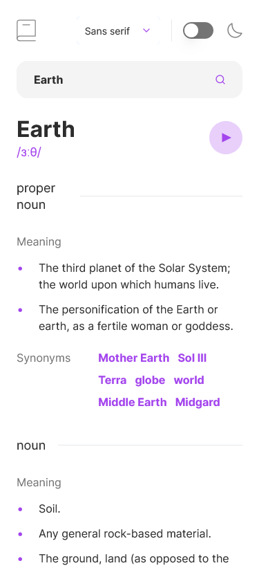
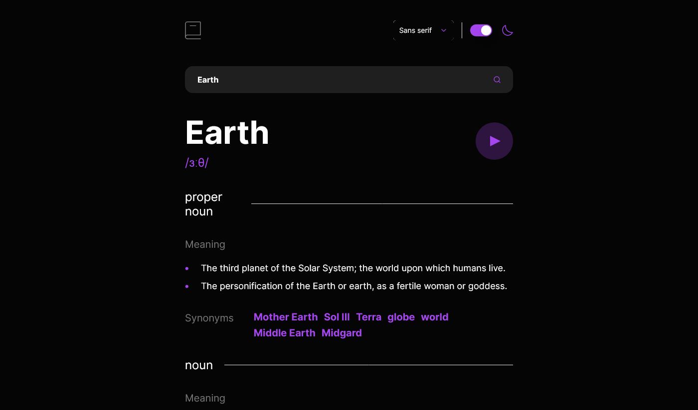

# Frontend Mentor - Dictionary web app solution

This is a solution to the [Dictionary web app challenge on Frontend Mentor](https://www.frontendmentor.io/challenges/dictionary-web-app-h5wwnyuKFL). Frontend Mentor challenges help you improve your coding skills by building realistic projects.

## Table of contents

- [Overview](#overview)
  - [The challenge](#the-challenge)
  - [Screenshot](#screenshot)
- [My process](#my-process)
  - [Built with](#built-with)
  - [What I learned](#what-i-learned)
  - [Continued development](#continued-development)
- [Author](#author)
- [Acknowledgments](#acknowledgments)

**Note: Delete this note and update the table of contents based on what sections you keep.**

## Overview

### The challenge

Users should be able to:

- Search for words using the input field
- See the Free Dictionary API's response for the searched word
- See a form validation message when trying to submit a blank form
- Play the audio file for a word when it's available
- Switch between serif, sans serif, and monospace fonts
- Switch between light and dark themes
- View the optimal layout for the interface depending on their device's screen size
- See hover and focus states for all interactive elements on the page

### Screenshot

#### Mobile View:

#### Desktop View:

## My process

### Built with

- [React](https://reactjs.org/) - JS library
- [Tailwind CSS](https://tailwindcss.com/) - For styles
- [Free Dictionary API](https://dictionaryapi.dev/) - For dictionary data
- [Shadcn](https://ui.shadcn.com/) - for UI Components
- [React Hook Form](https://www.react-hook-form.com/) - for form validation
- [Tanstack Query](https://tanstack.com/query/) - for data fetching

### What I learned

- I learned how to use React Hook Form to easily handle Forms data
- I also learned about Tanstack query for data fetching, and how to use it with React Hook Form

### Continued development

I'm getting more and more familiar with using React & TypeScript. Adding types for every variable seems exhausting at first, but it helps a lot in the long run.
During this project, I discovered that I'm still have a long way to learn React, especially it's hooks as they are sometimes confusing and hard to understand.

## Author

- Frontend Mentor - [@Earthyyy](https://www.frontendmentor.io/profile/Earthyyy)
- Github - [@Earthyy](https://github.com/Earthyyy)

## Acknowledgments

Big Thanks <3 to :

- [Web Dev Simplified](https://www.youtube.com/channel/UCFbNIlppjAuEX4znoulh0Cw)
- [ByteGrad](https://www.youtube.com/@ByteGrad)
- [Frontend Mentor](https://www.frontendmentor.io/)
